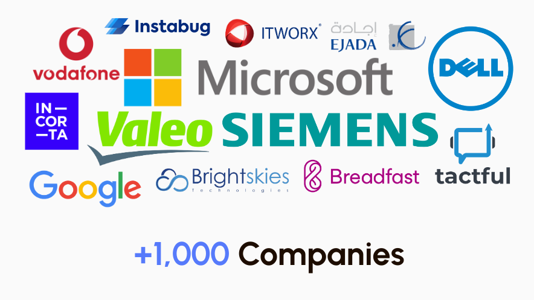
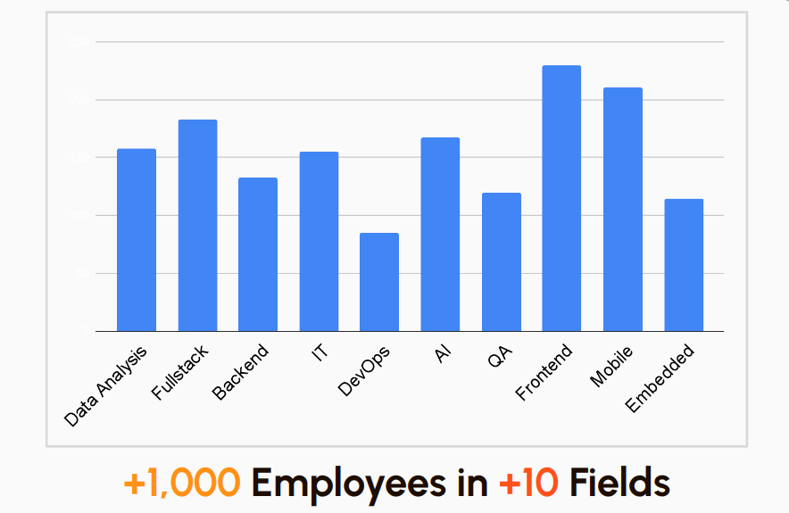
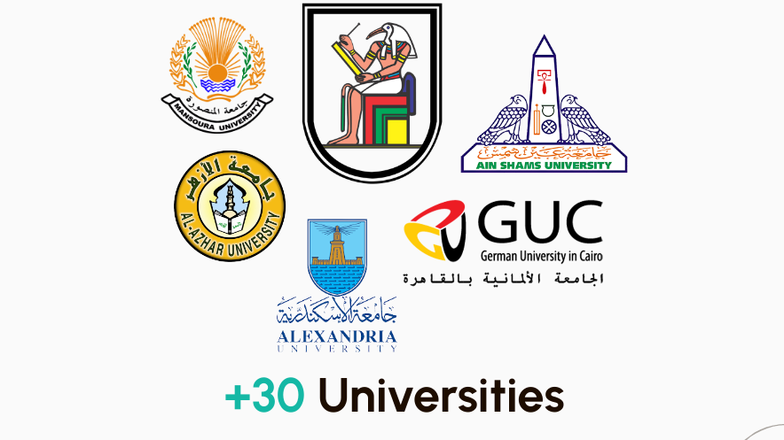

# Exploring the Landscape of the Egyptian Software Market

## A Data-driven Approach

Our story begins with a quest for knowledge. The information we obtained from LinkedIn offers us unprecedented insights into the landscape of the Egyptian Software Industry.

If you love stories, you can check our conversation with Hazem and his friend Wael from [here](./Story.pdf).

## Table of Contents

- [Exploring the Landscape of the Egyptian Software Industry](#exploring-the-landscape-of-the-egyptian-software-industry)
  - [A Data-driven Approach](#a-data-driven-approach)
  - [Table of Contents](#table-of-contents)
  - [The Data](#the-data)
  - [Insights](#insights)
  - [Data Collection](#data-collection)
    - [Challenges](#challenges)
  - [Data Preprocessing](#data-preprocessing)
    - [Parsing](#parsing)
      - [Experience](#experience)
      - [Education Parser](#education-parser)
      - [Licenses and Certifications Parser](#licenses-and-certifications-parser)
      - [Volunteering Parser](#volunteering-parser)
      - [Skills Parser](#skills-parser)
      - [Languages Parser](#languages-parser)
    - [Normalization](#normalization)
      - [Experience Normalization](#experience-normalization)
      - [Education Normalization](#education-normalization)
      - [Volunteering Normalization](#volunteering-normalization)
      - [Skills Normalization](#skills-normalization)
  - [Questions](#questions)
    - [Descriptive questions](#descriptive-questions)
    - [Exploratory questions](#exploratory-questions)
    - [Predictive Questions](#predictive-questions)
    - [Casual questions](#casual-questions)
    - [Mechanistic questions](#mechanistic-questions)
  - [Results Interpretation for our Questions](#results-interpretation-for-our-questions)
    - [Descriptive questions](#descriptive-questions-1)
    - [Exploratory questions](#exploratory-questions-1)
    - [Predictive Questions](#predictive-questions-1)
    - [Casual questions](#casual-questions-1)
    - [Mechanistic questions](#mechanistic-questions-1)

## The Data

We have collected the data for over 1,000 software companies.

And over 1,000 software professionals.

From more than 30 universities.

Emphasizing the following aspects.

## Insights

We have analyzed and tortured the data to extract the following insights.

1. New rising and available professions in the market.
2. Effect of student activities on your career.
3. Effect of college on your career.
4. Turn over rates in Egypt.
5. Factors affecting companies' turnover.
6. ITI effect on the market.
7. Shifting career in egypt.

## Data Collection

Our data contains the scraped LinkedIn profiles of Egyptian Software Engineers and their companies. We collected different sections from each profile such as experience, skills, education, volunteering experience, and licenses and certificates. We also collected data about the companies such as the company name, company size, headquarters, industry, company description, etc…

### Challenges

When we started building our scraper that will extract the needed data from the profiles, we were surprised that LinkedIn doesn’t allow web scraping bots to crawl the pages. In addition, the request needs to be authenticated in order to get the profile data.
We thought of using Selenium and making it behave like a human to login and search for profiles and collect the data in a slower manner, but we found out that LinkedIn has a limit of 200-500 profile views per day and would put your account under the possibility of getting banned. So, we decided to create fake accounts on LinkedIn and let Selenium use them to collect as many profiles as possible.
Unfortunately, after leaving the scrapers for a few hours, we checked the downloaded profiles’ HTML and found out that only 3-10 profiles were downloaded and the rest of the files were Sign Up pages which means that LinkedIn locked the scraper from reaching the profiles.
At last, we decided to do it manually and visit people’s profiles and download the HTML. We were capable of downloading about 1000 personal profiles and more than 1000 company profiles.
We know that this isn’t enough and the results may not be very accurate but we tried to answer the questions in a way that enables us to get more accurate answers as more data we have.

## Data Preprocessing

After downloading the HTML, we created different parsers using JavaScript to extract the needed data from the HTML files.
At first,  we extracted the section from each personal profile into separate files. Then created a parser for each section, Experience, Education, Volunteering Experience, Licenses and Certifications, Skills, and Languages. Each parser takes the HTML of its section and creates a JSON containing the extracted data. Lastly, we cleaned and normalized the JSON data and created CSV files in order to work with it easily.

### Parsing

#### Experience

Transform each position into a JSON object with the following attributes

| Attribute      | Description                                            |
| -------------- | ------------------------------------------------------ |
| Company        | The name of the company                                |
| CompanyUrl     | The URL of the company that the person worked in       |
| Duration       | The duration of the person in the position (in months) |
| EmploymentType | Full-time, Parme, or Internship                        |
| From           | The starting date in the position (MM YYYY)            |
| Location       | The location of the person during this job position    |
| Title          | The job title of the person in the company             |
| To             | The end date in the position (MM YYYY)                 |
| User           | The username of the person                             |

#### Education Parser

Transform each education into a JSON object with the following attributes:

| Attribute      | Description                                            |
| -------------- | ------------------------------------------------------ |
| Date      | The start and end dates of the education                    |
| Degree | The degree that the person obtained at the university          |
| University | The name of the university attended by the person          |
| User | The username of the person                                       |

#### Licenses and Certifications Parser

Transform each license/certificate into a JSON object with these attributes:

| Attribute | Description                                 |
| --------- | ------------------------------------------- |
| Date      | The date of getting the license/certificate |
| Issuer    | The issuer of the license/certificate       |
| Title     | The name of the license/certificate         |
| User      | The username of the person                  |

#### Volunteering Parser

Transform each volunteering experience into a JSON object with these attributes

| Attribute    | Description                                      |
| ------------ | ------------------------------------------------ |
| Date         | The start and end dates of the volunteering work |
| Organization | The name of the organization                     |
| Role         | The volunteering role that the person did        |
| User         | The username of the person                       |

#### Skills Parser

Transform each skill into a JSON object with the following attributes

| Attribute | Description                                       |
| --------- | ------------------------------------------------- |
| Skill1    | The first featured skill in the person’s profile  |
| Skill2    | The second featured skill in the person’s profile |
| Skill3    | The third featured skill in the person’s profile  |
| User      | The username of the person                        |

#### Languages Parser

Transform each language into a JSON object with the following attributes

| Attribute   | Description                              |
| ----------- | ---------------------------------------- |
| Proficiency | The person’s proficiency in the language |
| Title       | The name of the language                 |
| User        | The username of the person               |

### Normalization

We had to normalize the data we collected from the parser and create specific tags for each categorical feature to deal with a finite set of variables. Also, we lowered case all the strings and removed any unnecessary characters like hyphens, apostrophes, quotations, commas, dots, etc…

#### Experience Normalization

We created a new attribute called title_tag which contains a normalized and specific tag for each field in the software industry like Frontend, Backend, AI, DevOps, etc…. For example, each of the “Machine Learning Engineer”, “Computer Vision Engineer”, and “AI Researcher” job titles would have the same title_tag which is “AI”.
Note that we made the “software” tag the default title_tag if none of the other rules didn’t match. Also, we have title tags called “Teaching”, “Internship”, and “Student” which may not be looked at while answering the project’s questions.

#### Education Normalization

We removed the records that have no degree. And removed faulty education universities like IGCSE, Udacity, Udemy, Coursera, HarvardX, FreeCodeCamp, etc…
Also, same as in experience normalization, we created a new attribute called university_name which contains normalized and a specific tag for each university. For example, each of “Ain Shams University”, and “Ain-Shams University” will have a university_name of “ain shams”.
Lastly, we tried to infer the faculty name from the university name or from the degree string and assign a specific faculty name for each record in the education CSV file. For example, if the university name or the degree contains any words like “Computer”, “Technology”, “Artificial”, etc…, then the tag faculty_name would be “computer” and so on for the rest of the faculties.

#### Volunteering Normalization

#### Skills Normalization

## Questions

We have asked the following questions and tried to answer them using the data we collected.

### Descriptive questions

1. What is Job Titles Distribution Across The Software Industry in The Last Years? [Detailed Answer](./notebooks/decriptive.ipynb)
2. What Is The Percentage Of Turnover In The Market? [Detailed Answer](./notebooks/decriptive.ipynb)

### Exploratory questions

1. What is the Relation Between the High Education and Career? [Detailed Answer](./notebooks/exploratory1-2.ipynb)
2. What is The Relation Between Joining Student Activities And Working After Graduation? [Detailed Answer](./notebooks/exploratory1-2.ipynb)
3. What is The Relation Between Company Attributes And The Time Software Engineer Works On It? [Detailed Answer](./notebooks/exploratory3.ipynb)

### Predictive Questions

1. Can we Predict the size of the company you will join after graduation? [Detailed Answer](./notebooks/predictive.ipynb)

### Casual questions

1. Do people have to join ITI to be able to work in the software industry? [Detailed Answer](./notebooks/causal.ipynb)

### Mechanistic questions

1. People from different backgrounds shift to the software industry, how do they do so and why? [Detailed Answer](./notebooks/mechanistic.ipynb)

## Results Interpretation for our Questions

### Descriptive questions

1. What is Job Titles Distribution Across The Software Industry in The Last Years?

As we saw in the [notebook](./notebooks/decriptive.ipynb), the fields which are related to AI & Date (NLP, Data Science, Data Engineer, Data Analyst, and Machine Learning) are increasing, this can be explained by the increase in the demand for these fields in the last years. Also, the increase in the DevOps  (Development and Operations) field can be explained as this field is relatively new, and more and more companies are adopting it.

2. What Is The Percentage Of Turnover In The Market?

People in the software industry often don't stay long in their companies due to factors such as a dynamic job market with numerous opportunities for career growth and new challenges, the rapid pace of technological advancements leading to the need for upskilling, and the high demand for specialized skills creating a competitive environment where employees may seek better compensation or opportunities elsewhere.

### Exploratory questions

1. What is the Relation Between the High Education and Career?
From the data we collected we can describe the effect of higher education on your career in main 3 factors, the skills you gain, the field you will work on and your first company 

2. What is The Relation Between Joining Student Activities And Working After Graduation?
It doesn't have much effect in your overall career, however, some companies favour people who have joined student activities before graduation. 

3. What is The Relation Between Company Attributes And The Time Software Engineer Works On It?
The founded year is a strong metric in affecting the time employee stays in the company which makes sense because an older company means a more stable & established company & that's a good environment for any employee.
The Company size also shows a good metric but not stronger than founded metric.
Making a combination between an old company & a big company size would ensure more & more that the employee time within this company will be longer.

### Predictive Questions

1. Can we Predict the size of the company you will join after graduation?

Based on the analysis of our previous models, several key observations can be made:

Performance improvement: Our models have demonstrated superior performance compared to the dummy model in terms of both f1-score and accuracy. This signifies that the chosen features, namely "university, and faculty" significantly influence the company size that individuals are likely to join after completing their graduation. The results suggest a real and meaningful relationship between the current university and faculty attended and subsequent career outcomes.

Learning curve analysis: Upon analyzing the learning curves, it becomes evident that our model is exhibiting signs of overfitting. Despite the low complexity of our models-concluded from the bias-variance analysis-, the overfitting issue is likely attributable to the limited size of our dataset. With a small amount of training data, the model struggles to capture the underlying patterns and complexities of the problem at hand. This limitation hampers the model's ability to generalize and perform optimally on unseen data.

Addressing the overfitting concern requires careful consideration. Collecting more data could potentially help mitigate the issue and enable our models to better capture the intricacies of the relationship between the selected features and the company size.

### Casual questions

1. Do people have to join ITI to be able to work in the software industry? 

As we have seen in the data and as we have concluded from the hypothesis testing, we found that ITI is not the only way to work in the software industry. There are many people who have shifted their careers to the software industry without joining ITI. However, some professions are more affected by ITI than others. For example, most of the people working in the DevOps field have joined ITI. This comes from the fact that our universities don't teach DevOps and most of the people working in this field had to join ITI to learn it. The same applies to the UI/UX field, game development, and other fields.

Nevertheless, we can't deny the fact that ITI is one of the best ways to work in the software industry.

### Mechanistic questions

1. People from different backgrounds shift to the software industry, how do they do so and why?

In the causal question, it was proven that there is no significant causal relationship between ITI and people shifting their career to the software industry. Shifting careers to the software industry seems to depend on the faculty individuals graduated from, with a majority of those who shifted their careers having graduated from an electronics major. The reasons for this include studying programming courses in their major, being unable to join CS/CE majors due to acceptance criteria, and having a background in the software industry through common courses. For individuals from other majors, the primary reason for shifting to the software industry is the high salaries offered compared to their original professions. Other factors include the potential for high salary growth, daily challenges that prevent monotony, numerous job opportunities, a culture of mutual respect, flexibility in work hours and location, adding value to society, not requiring formal education in a specific field, and providing fulfillment and satisfaction. Some fields, such as Embedded Systems, UI/UX, and QA, are particularly attractive for individuals from other professions to shift to within the software industry. This is due to their combination of hardware and software (embedded systems), design and software (UI/UX), and the accessibility of the field (QA). Additionally, high salaries, high demand, and work flexibility are common reasons across different fields. The causal question also demonstrated that ITI assists people in transitioning to specific jobs, providing an advantage over CS/CE graduates in professions not typically taught in CS/CE courses.
